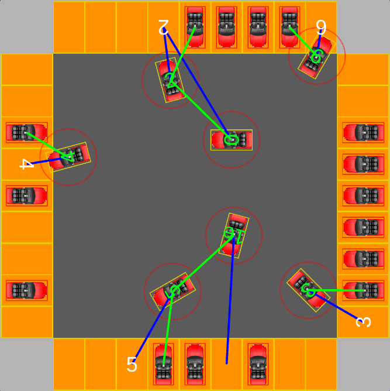

# Multi-Agent Car Parking using Reinforcement Learning

https://arxiv.org/abs/2206.13338

<br/>
<p align="center">
  
</p>


## Directories
* MultiAgentCarParkingEnvironment - Unity project containing the implementation of the MDP (environment)
* ppo - scripts related to training PPO and its analysis
* q-learning - scripts related to training Q-Learning and its analysis
* results - results
  
## Environment notes
* MultiAgentCarParkingEnvironment comes with a neural network model attached to the CarAgents. Remove the neural network attached to the Car prefab before building if intending to train (and also set the appropriate initMode of the EnvironmentManager).
* Scripts/Logger in the scene should be enabled if one requires a logger within play mode.

## Required software
* Unity version 2020.3.14f1
* ML-Agents (https://github.com/Unity-Technologies/ml-agents) - explained in subsequent README files
* Python 3
* C#.NET, Visual Studio or Jetbrains Rider
* CSV file reader e.g. Excel, etc.

## General note
Development was done on Windows, with the RL training run on Linux. We have not tested the implementations on other OSs.

## Demo

Below shows an example trained model with 7 agents and 16 parked cars:

https://youtu.be/xMCpVxDpogA

## Citing

One must cite this work if used.

Please use the following Bibtex citation:

```bib
@misc{tanner2022multiagent,
      title={Multi-Agent Car Parking using Reinforcement Learning}, 
      author={Omar Tanner},
      year={2022},
      eprint={2206.13338},
      archivePrefix={arXiv},
      primaryClass={cs.LG}
}
```
Otherwise, cite the arXiv document.
